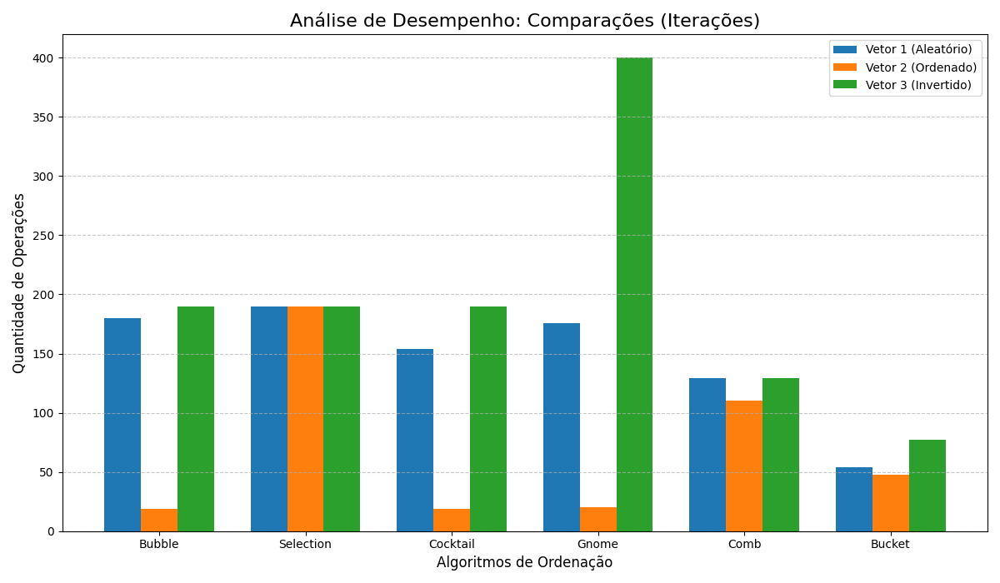
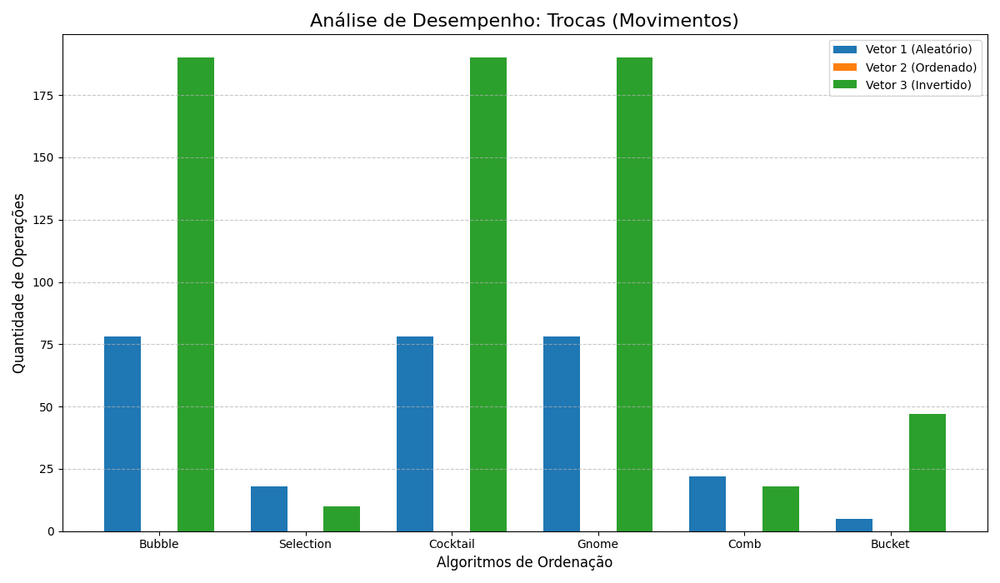

# Projeto de Análise de Algoritmos de Ordenação

Este repositório contém um projeto da disciplina de Estrutura de Dados com o objetivo de implementar e comparar o desempenho de seis algoritmos de ordenação:

1.  **Comb Sort** 
2.  **Gnome Sort** 
3.  **Bucket Sort** 
4.  **Bubble Sort** 
5.  **Selection Sort**
6.  **Cocktail Sort** 

O objetivo é analisar o número de **comparações** (iterações de laço) e **trocas** (movimentações de elementos) para três cenários de vetores diferentes.

## Implementação

Os algoritmos foram implementados em Java
A arquitetura utiliza uma interface `AlgoritmoDeOrdenacao`, e cada algoritmo (ex: `BubbleSort.java`, `GnomeSort.java`) a implementa. Isso permite que a classe `Main.java` trate todos os algoritmos de forma polimórfica, limpando o código.

## Como Executar

1.  Clone o repositório.
2.  Coloque todos os arquivos `.java` numa pasta `src`.
3.  Compile todos os arquivos `.java` (ex: `javac src/*.java -d out`).
4.  Execute a classe principal (ex: `java -cp out Main`).
5.  O consola exibirá as tabelas de resultados.

Alternativamente,é possivel apenas baixar todos os scripts,jogá-los na sua IDE de preferencia e rodar a classe main 

## Vetores de Teste

* **Vetor 1 (Aleatório):** `{12, 18, 9, 25, 17, 31, 22, 27, 16, 13, 19, 23, 20, 30, 14, 11, 15, 24, 26, 28}`
* **Vetor 2 (Ordenado):** `{5, 7, 9, 10, 12, 14, 15, 17, 19, 21, 22, 23, 24, 25, 27, 28, 29, 30, 31, 32}`
* **Vetor 3 (Invertido):** `{99, 85, 73, 60, 50, 40, 35, 30, 25, 20, 15, 14, 13, 12, 11, 10, 9, 8, 7, 6}`

---

## Resultados

Abaixo estão os dados de desempenho recolhidos da execução do programa.

### Resultados (Tabelas)

Para uma análise precisa dos números exatos.

**Tabela de Comparações (Iterações)**
| Algoritmo | Vetor 1 (Aleatório) | Vetor 2 (Ordenado) | Vetor 3 (Invertido) |
| :--- | :---: | :---: | :---: |
| **Bubble Sort** | 180 | 19 | 190 |
| **Selection Sort** | 190 | 190 | 190 |
| **Cocktail Sort** | 154 | 19 | 190 |
| **Gnome Sort** | 176 | 20 | 400 |
| **Comb Sort** | 129 | 110 | 129 |
| **Bucket Sort** | 54 | 48 | 77 |

**Tabela de Trocas (Movimentos)**
| Algoritmo | Vetor 1 (Aleatório) | Vetor 2 (Ordenado) | Vetor 3 (Invertido) |
| :--- | :---: | :---: | :---: |
| **Bubble Sort** | 78 | 0 | 190 |
| **Selection Sort** | 18 | 0 | 10 |
| **Cocktail Sort** | 78 | 0 | 190 |
| **Gnome Sort** | 78 | 0 | 190 |
| **Comb Sort** | 22 | 0 | 18 |
| **Bucket Sort** | 5 | 0 | 47 |

### Resultados Visuais (Gráficos)

Para uma comparação rápida e visual do desempenho.

**Gráfico de Comparações**

**Gráfico de Trocas**

---

## Análise e Conclusão

Com base nas tabelas e gráficos, podemos tirar algumas conclusões:

1.  **Melhor Caso (Vetor 2 - Ordenado):**
    * Os algoritmos **Bubble Sort (com flag)** e **Cocktail Sort** são os mais eficientes. Eles percebem que o vetor está ordenado e terminam muito rápido, com o mínimo de comparações (19) e zero trocas.
    * O **Gnome Sort** é quase igual, com 20 comparações.
    * **Bucket Sort** (48 comparações) e **Comb Sort** (110 comparações) são *piores* neste cenário, porque os seus mecanismos de "gap" e "buckets" forçam-nos a fazer mais verificações mesmo no vetor já ordenado.

2.  **Pior Caso (Vetor 3 - Invertido):**
    * Aqui vemos a maior diferença. Para **comparações**, o **Bucket Sort (77)** e o **Comb Sort (129)** são muito superiores aos demais. O **Gnome Sort (400)** teve o pior desempenho de todos, como o gráfico mostra.
    * Para **trocas**, o **Selection Sort (10)** é o melhor, provando o seu ponto forte de minimizar movimentações. O **Comb Sort (18)** é o segundo melhor.

3.  **Caso Comum (Vetor 1 - Aleatório):**
    * O **Bucket Sort** é o vencedor geral neste cenário, sendo o melhor em **comparações (54)** e também o melhor em **trocas (5)**, com uma vantagem enorme.
    * O **Selection Sort** é o pior em comparações (190), mas o segundo melhor em trocas (18).
    * **Bubble, Cocktail e Gnome** têm desempenhos idênticos em trocas (78), sendo os piores nesse quesito.

**Conclusão Final:**
* Para um desempenho geral no **caso médio (aleatório)**, o **Bucket Sort** é o melhor algoritmo disparado, vencendo em ambas as métricas.
* Para dados **já ordenados**, o **Bubble Sort (com flag)** ou **Cocktail Sort** são as escolhas ideais.
* Se o objetivo principal for **minimizar as trocas** (movimentações), o **Selection Sort** é o campeão, sendo o melhor no caso invertido e o segundo melhor no caso aleatório.
* O **Comb Sort** mostra-se um algoritmo muito bom e equilibrado, ficando em segundo lugar em performance nos cenários mais difíceis (Aleatório e Invertido).
